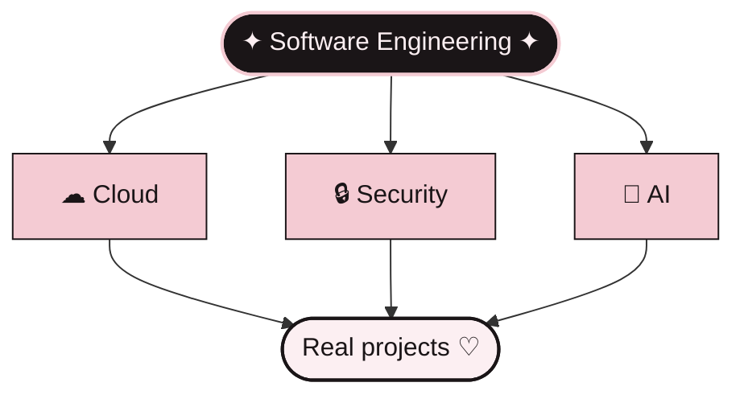

<div align="center">


<br/>


</div>

<br/>

## ♡ About me

Hi, I'm **Shamimah** — an Applied Computer Science student at the Université des Mascareignes, building my way towards **Software Engineering**.

I love the technical side of things, but I also care about aesthetics, details, and the feeling something gives when you use it.
For me, code doesn't have to feel cold — it can be **precise *and* pretty**.

<br/>

## ✦ Tech wardrobe

<div align="center">

**The foundations**


<br/><br/>

**Learning by building** ✦ *picking these up project after project*


<br/>

`PHP Slim` · `Tailwind CSS` · `Bootstrap 5` · `Vue.js` · `SQL Server`

<br/>

`Object-Oriented Programming` · `Web Development` · `REST APIs` · `Machine Learning`

</div>

<br/>

## 💼 Experience

<table>
<tr>
<td width="170" align="center"><b>Remote Intern</b><br/><sub>Web Development</sub></td>
<td>

**Connecticut Co Ltd** · IT company, Vacoas, Mauritius

Online internship through my university (last academic year), working in a six-person intern team on a PHP/MySQL web application. I led the team during the first week: coordinating the group and writing the requirements and planning documents.

</td>
</tr>
</table>

<br/>

## 🌸 Projects

<table>
<tr>
<td width="50%" valign="top">

### 🫧 COCON
*Student well-being platform*

End-of-year project (L2): a web platform for students' physical and mental well-being — counselor appointments, self-assessment questionnaires, an anonymous community forum, a resource library and a chatbot.

**Vue.js · Tailwind CSS · PHP Slim · SQL Server Express**


</td>
<td width="50%" valign="top">

### 🗂 Projet Adhésion
*Membership management web app*

Team project from my internship last academic year, built with **PHP · MySQL · Bootstrap 5** on XAMPP, with three roles: admin, staff and member. Left unfinished — but a real lesson in remote teamwork and scoping a complex spec.


</td>
</tr>
<tr>
<td width="50%" valign="top">

### 🏥 Santé+
*Clinic management system*

Academic project: requirements specification (cahier des charges) and use case diagram for a clinic management system.


</td>
<td width="50%" valign="top">

### ✨ Next
*More projects coming*

Every project teaches me something new — they'll land here as they grow.


</td>
</tr>
</table>

<sub>I write a report for every project I build — documenting is part of the craft.</sub>

<br/>

## ˚ Currently in my learning era

<div align="center">

[](https://cs50.harvard.edu/x/)
[](https://www.fun-mooc.fr/)

</div>

```text
> CS50 Introduction to Computer Science ... in progress
> FUN MOOC ................................. in progress
> CTF challenges ........................... in progress
> Tailwind CSS & Bootstrap ................. little by little
> learning JavaScript ...................... in progress
> exploring Machine Learning ............... in progress
> discovering Cloud ........................ in progress
> understanding Cybersecurity .............. in progress
> becoming a Software Engineer ............. loading ♡
```

<br/>

## ♡ The vision



<div align="center">

*learn the foundations → build → experiment → understand → grow*

</div>

<br/>

## ✧ Things I naturally love

<div align="center">


<sub>soft pink · black · delicate details · understated luxury</sub>

</div>

<br/>

## 🌸 My way of learning

<div align="center">

`curiosity` → `learn` → `code` → `break something` → `understand why` → `fix it` → `become better`

</div>

<br/>

## ♡ GitHub diary

<div align="center">


<br/>


</div>

<br/>

<div align="center">


<sub>made with curiosity · a little pink · and a lot of code</sub>


</div>
